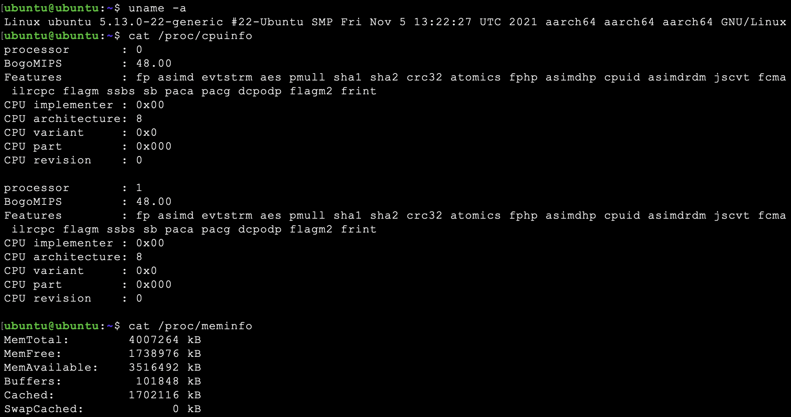

---

layout: post

title:  "链接并发测试工具及方法"

date:   2022-04-09 20:35:00

categories: network

tags: Apache Bench,TCPBurn

excerpt: 

mathjax: true

typora-root-url: ../../blog

---


# 链接并发测试工具及方法

## 一、目的

在项目中需要验证在中规模并发链接的场景下某些软件的性能消耗。 这个链接不单指TCP链接，也包含UDP报文流。但针对TCP和UDP验证的逻辑是一样的，即能模拟一定规模的对端访问。

针对测试工具的需求有：

- 能够设置单位时间内的并发客户端数量。

- 能够设置客户端一次交互的数据量。

- 能够显示单位时间内成功链接数、成功率指标。

- 能够显示单位时间内的总吞吐量。

- TCP并发量在1万 CPS，UDP 模拟1万客户端，百万PPS。资源消耗越小越好。

- 使用足够简单，最好不用编写代码。

- 单机使用。

## 二、备选

以前常用的软件工具是测试网络带宽和延时的工具，如iperf, netperf。测试并发链接一般用硬件测试仪如思博伦测试仪等。

那么是否有好用的软件并发链接测试工具呢，而且需要免费的。搜索了一下，可以使用这些工具：

### TCPBurn

TCPBurn is a replay tool which focuses on concurrency. All TCP-based applications which could be replayed could be stressed by this powerful tool .

这是一个并发的重放工具。（重放就是在服务端用过tcpdump 抓取客户端的请求消息，记录在pcap文件中，然后将pcap文件给TCPBurn读出里面的请求记录，将这些请求重新发往服务器）

根据文章描述，可以模拟百万到千万级的客户端进行测试，看起来TCP方面满足项目的需求，但似乎没有UDP测试功能。（参考《[TCPBurn并发测试](https://zhuanlan.zhihu.com/p/65790128)》）

### Dperf

dperf由百度的智能负载均衡团队研发，它能用来进行高达千万CPS 级别的压力测试，在部分场景下可代替售价数百万元的商用性能测试仪。dperf可用于进行HTTP新建连接数测试、HTTP并发连接数测试、HTTP吞吐测试、TCP/UDP的包转发性能（PPS）测试。

dperf是基于DPDK实现的。由于本地测试环境是apple M1芯片，该工具就无法测试了。

（参考《[千万级CPS的开源网络压测软件dperf](https://developer.baidu.com/article/detail.html?id=294625)》）

### Apache Bench(AB)

Apache Bench 是 Apache 服务器自带的一个web压力测试工具，简称ab。ab又是一个命令行工具，对发起负载的本机要求很低，根据ab命令可以创建很多的并发访问线程，模拟多个访问者同时对某一URL地址进行访问，因此可以用来测试目标服务器的负载压力。

### JMeter

Apache JMeter是一款纯java编写负载功能测试和性能测试开源工具软件。相比Loadrunner而言，JMeter小巧轻便且免费，逐渐成为了主流的性能测试工具。

JMeter有比较完整的UI界面，看起来功能强大且复杂。

### go-stress-testing

这是一个golang编写的小工具，可能和上面的工具比不是一个量级的，但因为我的项目就是golang编写的，使用这个工具不需要额外的环境依赖。而且文章中描述这个工具也能轻松完成百万级别的链接压力测试，看起来也是能满足要求的。（参考文章《 [压测工具如何选择? ab、locust、Jmeter、go压测工具](https://segmentfault.com/a/1190000020211494)》）

当然还有很多其它的工具可用，但相对来说参考文档没有上面的工具丰富，只要上面的工具有能满足要求的，就不需要再去研究其它工具了。

下面就开始试用上面的工具，看哪个工具既满足要求，又易用。

## 三、测试环境

先在本地虚拟机上进行测试，host为macbook air M1 ，内存只有8G。使用Vmware Fusion虚拟机软件。虚拟机系统为Ubuntu。因为只是试用，所以测试工具与被测服务都在该虚拟机内。



服务端原本想用python http server，但测了下性能太低影响测试，改为用最简单的Go web server

```go
package main

import (
    "log"
    "net/http"
    "runtime"
)

const (
    httpPort = "8000"
)

func main() {

    runtime.GOMAXPROCS(runtime.NumCPU() - 1)

    hello := func(w http.ResponseWriter, req *http.Request) {
        data := "Hello, World!"

        w.Header().Add("Server", "golang")
        w.Write([]byte(data))

        return
    }

    http.HandleFunc("/", hello)
    err := http.ListenAndServe(":"+httpPort, nil)

    if err != nil {
        log.Fatal("ListenAndServe: ", err)
    }
}
```

## 四、试用

### 4.1 go-stress-testing

下载并编译：

```shell
> git clone https://github.com/link1st/go-stress-testing.git
> cd go-stress-testing/
> go build


> ./go-stress-testing -h

Usage of ./go-stress-testing:
  -H value
        自定义头信息传递给服务器 示例:-H 'Content-Type: application/json'
  -c uint
        并发数 (default 1)
  -code int
        请求成功的状态码 (default 200)
  -d string
        调试模式 (default "false")
  -data string
        HTTP POST方式传送数据
  -http2
        是否开http2.0
  -k    是否开启长连接
  -m int
        单个host最大连接数 (default 1)
  -n uint
        请求数(单个并发/协程) (default 1)
  -p string
        curl文件路径
  -u string
        压测地址
  -v string
        验证方法 http 支持:statusCode、json webSocket支持:json 
```

简单测试一下，很轻松的做到并发 1W CPS。（当然这里要注意先把服务端和客户端的句柄数限制增大，否则会报too many open files错误。 可通过 ulimit -n 100000 临时设置）

```shell
> ./go-stress-testing -u http://localhost:8000 -c 10000

 开始启动  并发数:10000 请求数:1 请求参数: 
request:
 form:http 
 url:http://localhost:8000 
 method:GET 
 headers:map[Content-Type:application/x-www-form-urlencoded; charset=utf-8] 
 data: 
 verify:statusCode 
 timeout:30s 
 debug:false 
 http2.0：false 
 keepalive：false 
 maxCon:1 


─────┬───────┬───────┬───────┬────────┬────────┬────────┬────────┬────────┬────────┬────────
 耗时│ 并发数│ 成功数│ 失败数│   qps  │最长耗时│最短耗时│平均耗时│下载字节│字节每秒│ 状态码
─────┼───────┼───────┼───────┼────────┼────────┼────────┼────────┼────────┼────────┼────────
   1s│  10000│  10000│      0│18618.48│  764.26│  198.67│  537.10│ 130,000│ 153,093│200:10000


*************************  结果 stat  ****************************
处理协程数量: 10000
请求总数（并发数*请求数 -c * -n）: 10000 总请求时间: 0.849 秒 successNum: 10000 failureNum: 0
tp90: 732.000
tp95: 743.000
tp99: 759.000
*************************  结果 end   ****************************
```

可惜的是该工具不支持UDP发包，TCP压测方面也没有持续定速并发功能，如果设置了大并发，会导致每秒的并发数反而会下降。不过该工具是开源的，应该可以修改一下。


### 4.2 Apache Bench(AB)

Apache Bench 是带在Apache服务器里面的一个小工具，可以去安装一个Apache或者httpd，里面就带有ab。

在ubuntu上可以这样安装：

```shell
> sudo apt-get install apache2-utils

> ab -h
Usage: ab [options] [http[s]://]hostname[:port]/path
Options are:
    -n requests     Number of requests to perform
    -c concurrency  Number of multiple requests to make at a time
    -t timelimit    Seconds to max. to spend on benchmarking
                    This implies -n 50000
    -s timeout      Seconds to max. wait for each response
                    Default is 30 seconds
    -b windowsize   Size of TCP send/receive buffer, in bytes
    -B address      Address to bind to when making outgoing connections
    -p postfile     File containing data to POST. Remember also to set -T
    -u putfile      File containing data to PUT. Remember also to set -T
    -T content-type Content-type header to use for POST/PUT data, eg.
                    'application/x-www-form-urlencoded'
                    Default is 'text/plain'
    -v verbosity    How much troubleshooting info to print
    -w              Print out results in HTML tables
    -i              Use HEAD instead of GET
    -x attributes   String to insert as table attributes
    -y attributes   String to insert as tr attributes
    -z attributes   String to insert as td or th attributes
    -C attribute    Add cookie, eg. 'Apache=1234'. (repeatable)
    -H attribute    Add Arbitrary header line, eg. 'Accept-Encoding: gzip'
                    Inserted after all normal header lines. (repeatable)
    -A attribute    Add Basic WWW Authentication, the attributes
                    are a colon separated username and password.
    -P attribute    Add Basic Proxy Authentication, the attributes
                    are a colon separated username and password.
    -X proxy:port   Proxyserver and port number to use
    -V              Print version number and exit
    -k              Use HTTP KeepAlive feature
    -d              Do not show percentiles served table.
    -S              Do not show confidence estimators and warnings.
    -q              Do not show progress when doing more than 150 requests
    -l              Accept variable document length (use this for dynamic pages)
    -g filename     Output collected data to gnuplot format file.
    -e filename     Output CSV file with percentages served
    -r              Don't exit on socket receive errors.
    -m method       Method name
    -h              Display usage information (this message)
    -I              Disable TLS Server Name Indication (SNI) extension
    -Z ciphersuite  Specify SSL/TLS cipher suite (See openssl ciphers)
    -f protocol     Specify SSL/TLS protocol
                    (SSL2, TLS1, TLS1.1, TLS1.2 or ALL)
    -E certfile     Specify optional client certificate chain and private key
```

Apache Bench 的功能丰富很多，但我们先测试一下最简单并发，只用-c 和-n 参数

```shell
> ab -c 10000 -n 10000 http://localhost:8000/

This is ApacheBench, Version 2.3 <$Revision: 1879490 $>
Copyright 1996 Adam Twiss, Zeus Technology Ltd, http://www.zeustech.net/
Licensed to The Apache Software Foundation, http://www.apache.org/

Benchmarking localhost (be patient)
Completed 1000 requests
Completed 2000 requests
Completed 3000 requests
Completed 4000 requests
Completed 5000 requests
Completed 6000 requests
Completed 7000 requests
Completed 8000 requests
Completed 9000 requests
Completed 10000 requests
Finished 10000 requests


Server Software:        golang
Server Hostname:        localhost
Server Port:            8000

Document Path:          /
Document Length:        13 bytes

Concurrency Level:      10000
Time taken for tests:   0.398 seconds
Complete requests:      10000
Failed requests:        0
Total transferred:      1460000 bytes
HTML transferred:       130000 bytes
Requests per second:    25111.81 [#/sec] (mean)
Time per request:       398.219 [ms] (mean)
Time per request:       0.040 [ms] (mean, across all concurrent requests)
Transfer rate:          3580.39 [Kbytes/sec] received

Connection Times (ms)
              min  mean[+/-sd] median   max
Connect:        0  114  32.4    113     195
Processing:    24   97  51.6     91     196
Waiting:        1   97  51.6     91     175
Total:        134  211  74.9    155     318

Percentage of the requests served within a certain time (ms)
  50%    155
  66%    291
  75%    292
  80%    292
  90%    294
  95%    300
  98%    308
  99%    311
 100%    318 (longest request)
```

这里的并发 1W CPS瞬间就完成了，比上面的go-stress-testing更快，果然是比较成熟的工具。但这里还是不支持设置一个持续测试时间。 

更多的参数这里就先不测试了，总的来说，在我的需求范围内，AB和go-stress-testing是一样的，AB性能会更好一些。


## 五、总结

其实我的需求并不复杂，简单的AB、go-stress-testing工具在TCP方面都可以满足需求。我相信其它三个工具也是能满足要求的，但在UDP方面，看起来只有Dperf具备此能力，后面可能需要找一台x86机器测试一下。


